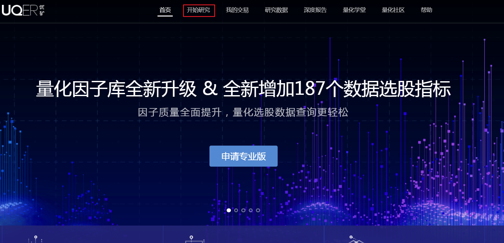
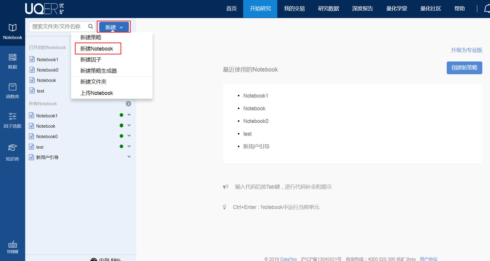
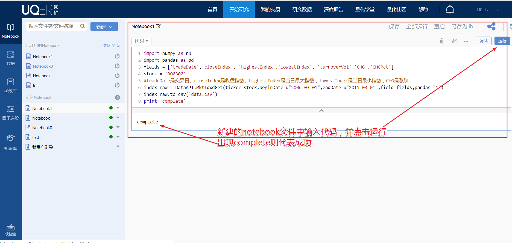
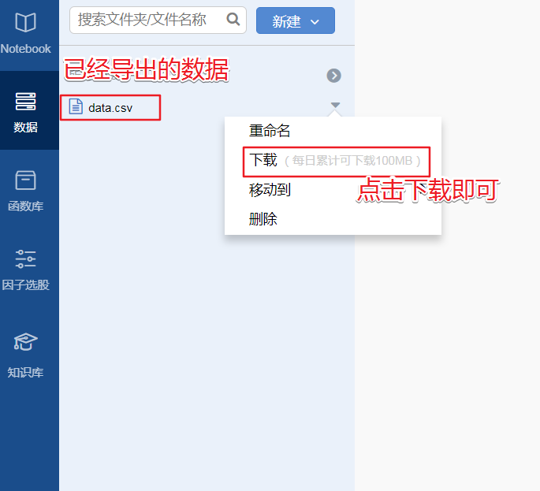

## 如何获取大盘指数
1. 注册/登录[优矿网站](https://uqer.io/):
2. 在首页上方寻找 **开始研究**，点击，进入编程环境

3. 在编程环境的左上角，点击**新建**，新建一个ipynb文件

4. 在新出现的notebook的cell中，输入以下代码,点击运行，如果出现 `complete` 字样,则表明程序运行成功
```python
fields = ['tradeDate','closeIndex', 'highestIndex','lowestIndex', 'turnoverVol','CHG','CHGPct']
stock = '000300'
#tradeDate是交易日、closeIndex是收盘指数、highestIndex是当日最大指数，lowestIndex是当日最小指数，CHG是涨跌
index_raw = DataAPI.MktIdxdGet(ticker=stock,beginDate=u"2006-03-01",endDate=u"2015-03-01",field=fields,pandas="1")
index_raw.to_csv('data.csv')
print 'complete'
```



5.程序运行成功以后，选在左边竖栏中的`数据`，找到 `data.csv`下载即可

